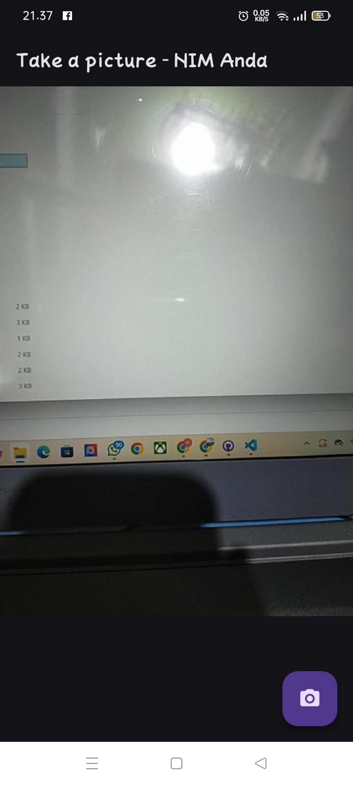
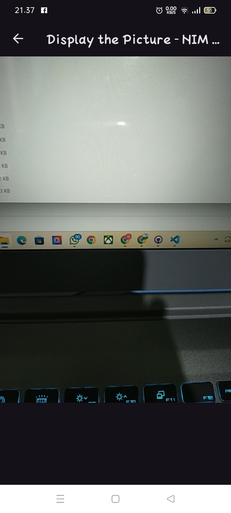

# Praktikum 1 & Praktikum 2 : Aplikasi Kamera Flutter

## Deskripsi :
Aplikasi ini merupakan implementasi kamera pada Flutter yang memungkinkan pengguna untuk mengambil foto menggunakan kamera perangkat.
Aplikasi ini merupakan implementasi kamera pada Flutter yang memungkinkan pengguna untuk:
- Mengambil foto menggunakan kamera perangkat.
- Menampilkan hasil foto yang telah diambil.
- Menambahkan filter carousel pada foto yang diambil (gabungan dengan Praktikum 2).

## 🚀 Instalasi :
1. Pastikan Flutter sudah terinstal di perangkat Anda.
2. Clone repository ini:
   ```sh
   git clone https://github.com/hraa3421/kamera-flutter
   cd repository
3. Install dependencies:
   flutter pub get
4. Jalankan aplikasi di emulator atau perangkat fisik :
   flutter run

##  Fitur yang Diimplementasikan
- Penggunaan Plugin camera → Mengakses kamera perangkat.
- Menampilkan Hasil Foto → Foto yang diambil ditampilkan di layar.
- Menambahkan Filter dengan Carousel → (Gabungan Praktikum 1 & 2).

## 🖼 Screenshot Running Take Picture



## 🖼 Screenshot running Display picture



## ❓ FAQ
 1. Apa yang dimaksud dengan void async pada praktikum 1?
    void async dalam Dart (Flutter) adalah kombinasi dari dua konsep[
    void → Menandakan bahwa fungsi tidak mengembalikan nilai.
    async → Menandakan bahwa fungsi berjalan secara asynchronous (tidak langsung dieksekusi secara berurutan), memungkinkan penggunaan await di dalamnya.
    dapat disimpulkan sebagai berikut : Gunakan async jika fungsi memiliki operasi yang butuh waktu (misalnya, mengambil foto, memuat data dari API, membaca file)
    
2. Jelaskan fungsi dari anotasi @immutable dan @override ?
   - Fungsi dari @immutable yaitu :
      ✅ Dapat digunakan untuk menandakan bahwa suatu class tidak boleh diubah (immutable) setelah dibuat,
      ✅ Biasanya diterapkan pada class yang bersifat stateless (tidak berubah setelah inisialisasi).
   - Fungsi dari @override yaitu :
     anotasi yang digunakan ketika kita ingin mengganti (menimpa) metode dari superclass (kelas induk) di dalam subclass (kelas anak).
     Kenapa @override Penting?
      ✅ Memastikan metode di subclass benar-benar menggantikan metode dari superclass.
      ✅ Mencegah kesalahan penulisan nama metode yang bisa menyebabkan bug.
      ✅ Membantu pembaca kode memahami bahwa metode tersebut berasal dari superclass.
   

    
